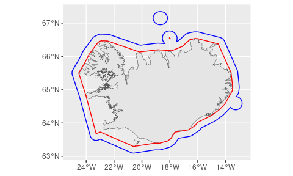

<!-- README.md is generated from README.Rmd. Please edit that file -->

# gisland

<!-- badges: start -->
<!-- badges: end -->

The goal of gisland is to wrap some often used MFRI spatial objects into
convenient functions.

## Installation

You can install the development version of gisland from
[GitHub](https://github.com/) with:

    # install.packages("devtools")
    remotes::install_github("einarhjorleifsson/gisland")

## Example

Some basic example illuminating features:

``` r
library(sf)
library(tidyverse)
library(gisland)
```

Get some object from [LMÍ geoserver](https://gis.lmi.is/geoserver):

``` r
iceland <- gl_lmi_strandlina()
glines <- gl_lhg_grunnlina()
miles12 <- gl_lhg_landhelgi()
```

What do we have?:

``` r
ggplot() +
  geom_sf(data = iceland) +
  geom_sf(data = glines, colour = "red") +
  geom_sf(data = miles12, colour = "blue")
```



Could also do:

``` r
library(mapview)
mapview(glines) + miles12
```
